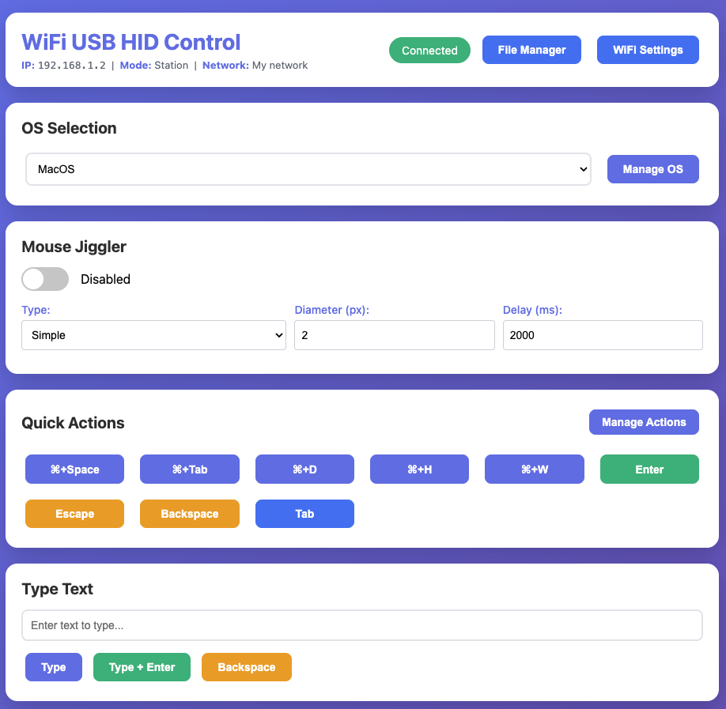
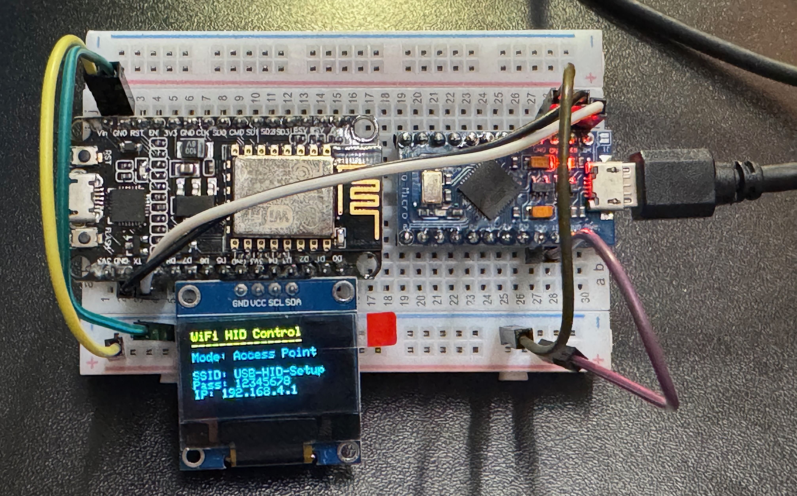

# WiFi USB HID Control

Remote control your computer's keyboard and mouse over WiFi - a dual-microcontroller USB HID automation tool.

## Overview

Control a computer's keyboard and mouse remotely using Pro Micro (ATmega32U4) as a USB HID device and NodeMCU (ESP8266) for WiFi connectivity. Perfect for automation, testing, accessibility, or education.

## Features

### Type Text

Type text remotely and send keyboard shortcuts to the target computer.

### Mouse Control with Live Trackpad

Control mouse movement with directional buttons or use the live trackpad with adjustable sensitivity (0.5x - 10x) for smooth, intuitive control on desktop and mobile devices.

### Quick Scripts

OS-specific quick scripts for common tasks on Windows, macOS, and Linux. Full DuckyScript support for automation.

### Activity Log

Real-time activity logging shows all commands and actions with timestamps.

### WiFi Management

Built-in WiFi manager with network scanner. Device starts in AP mode (SSID: "USB-HID-Setup") and can be configured to connect to your home/office network. Auto-reconnects on startup with automatic fallback to AP mode if connection fails.

### Additional Features

- **Mouse Jiggler** - Automatic movement to prevent screen lock
- **REST API** - Programmatic control via HTTP endpoints
- **Optional OLED Display** - 128x64 display shows status and IP address

## Hardware

**Required:**
- Pro Micro (ATmega32U4) - 5V/16MHz
- NodeMCU (ESP8266)
- 4× jumper wires (male-to-male)
- 1× Micro-USB cable

**Optional:**
- 128x64 I2C OLED display - Connect to D3 (SDA) and D4 (SCL) on NodeMCU
- Breadboard for easier connections

*NodeMCU and Pro Micro with optional OLED display*

## Software

- Arduino IDE 1.8+
- ESP8266 board support (install via Board Manager)
- Built-in libraries: Keyboard, Mouse, EEPROM
- Optional for OLED: Adafruit GFX, Adafruit SSD1306

## Quick Start

1. **Wire** - Connect 4 wires: VCC→Vin, GND→GND, TX→RX, RX→TX (crossed)
2. **Upload** - Flash `pro-micro/pro-micro.ino` (Leonardo board) and `nodemcu/nodemcu.ino` (NodeMCU 1.0)
3. **Upload web files** - Use LittleFS upload tool for `nodemcu/data/` folder
4. **Connect** - Plug Pro Micro into computer via USB (powers both devices)
5. **Access** - Connect to WiFi "USB-HID-Setup" (password: 12345678), open http://192.168.4.1

See **[SETUP.md](docs/SETUP.md)** for detailed instructions and **[WIRING.md](docs/WIRING.md)** for connection diagrams.

## Usage

- **AP Mode** (default): Device creates WiFi network "USB-HID-Setup"
- **Station Mode**: Configure WiFi via web interface to connect to your network
- **API**: See [API.md](docs/API.md) for REST endpoints and DuckyScript reference

All features work in both AP and Station modes.

## Safety Notice

For authorized use only on your own devices. Not for unauthorized access or malicious purposes.

## License

Provided as-is for educational and personal use.
