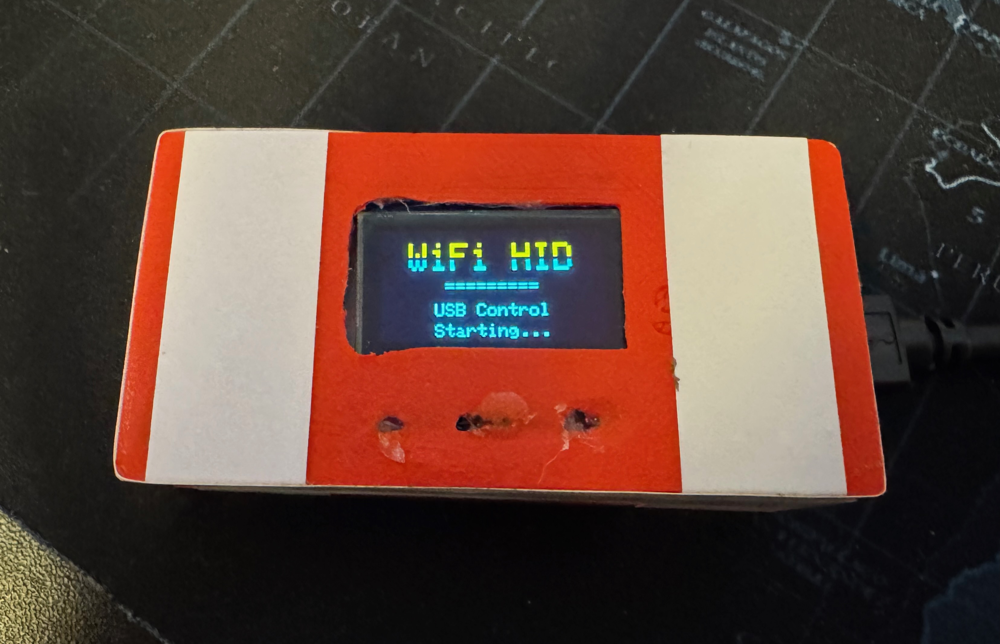
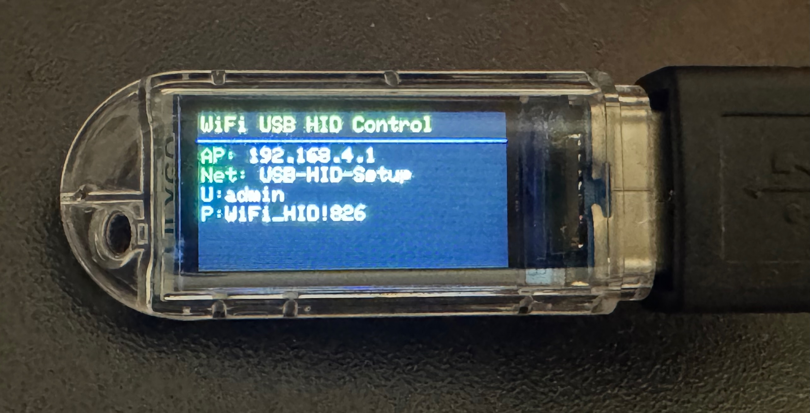

# WiFi USB HID Control

Remote control your computer's keyboard and mouse over WiFi - a dual-microcontroller USB HID automation tool.

## Overview

Control a computer's keyboard and mouse remotely. This project supports two hardware configurations:
1. **Dual-Microcontroller**: Using Pro Micro (ATmega32U4) as a USB HID device and NodeMCU (ESP8266) for WiFi connectivity.
2. **All-in-One (ESP32-S3)**: Using a single ESP32-S3 board (like the **Lilygo T-Dongle-S3**) which handles both WiFi and Native USB HID, and includes a built-in display and microSD card support.

Perfect for automation, testing, accessibility, or education.

## Features

A comprehensive list of features is available in the [FEATURES.md](docs/FEATURES.md) file.

-   Type Text
-   Mouse Control with Live Trackpad
-   Keyboard Capture
-   Quick Actions
-   Quick Scripts
-   Activity Log
-   Custom Operating Systems
-   WiFi Management
-   File Management
-   Web Authentication
-   HTTPS Support
-   Script Storage
-   Advanced Mouse Jiggler
-   REST API
-   Optional OLED Display

See **[FEATURES.md](docs/FEATURES.md)** for a detailed description of each feature.

## Hardware

### Option 1: Dual-Microcontroller Setup (Classic)
**Required:**
- Pro Micro (ATmega32U4) - 5V/16MHz
- NodeMCU (ESP8266)
- 4× jumper wires (male-to-male)
- 1× Micro-USB cable

**Optional:**
- 128x64 I2C OLED display - Connect to D3 (SDA) and D4 (SCL) on NodeMCU

  *NodeMCU and Pro Micro with optional OLED display*

*NodeMCU and Pro Micro with optional OLED display assembled in a small 3d printed box*

### Option 2: All-in-One (ESP32-S3)
**Recommended:**
- **Lilygo T-Dongle-S3**: A compact USB-dongle form factor with built-in 0.96" LCD and microSD card slot.
- Other ESP32-S3 boards with native USB support.

*Lilygo T-Dongle-S3 All-in-One Solution*

See the **[ESP32-S3 Sub-project README](esp32-s3/README.md)** for specific setup instructions for this hardware.

## Software

- Arduino IDE 1.8+
- ESP8266 board support (install via Board Manager)
- Built-in libraries: Keyboard, Mouse, EEPROM
- Optional for OLED: Adafruit GFX, Adafruit SSD1306

## Quick Start

### For Dual-Microcontroller Setup:
1. **Wire** - Connect 4 wires: VCC→Vin, GND→GND, TX→RX, RX→TX (crossed)
2. **Upload** - Flash `pro-micro/pro-micro.ino` (Leonardo board) and `nodemcu/nodemcu.ino` (NodeMCU 1.0)
3. **Upload web files** - Use LittleFS upload tool for `nodemcu/data/` folder
4. **Connect** - Plug Pro Micro into computer via USB (powers both devices)

See **[SETUP.md](docs/SETUP.md)** for detailed instructions and **[WIRING.md](docs/WIRING.md)** for connection diagrams.

### For ESP32-S3 (Lilygo T-Dongle):
Follow the instructions in the **[esp32-s3/README.md](esp32-s3/README.md)**.

### Common Steps:
1. **Access** - Connect to WiFi "USB-HID-Setup" (password: HID_M4ster), open http://192.168.4.1 or https://192.168.4.1
2. **Login** - Enter web credentials (username: admin, password: WiFi_HID!826)
3. **HTTPS Note** - For HTTPS, accept the browser security warning for the self-signed certificate

## Usage

- **AP Mode** (default): Device creates WiFi network "USB-HID-Setup"
- **Station Mode**: Configure WiFi via web interface to connect to your network
- **API**: See [API.md](docs/API.md) for REST endpoints and DuckyScript reference

All features work in both AP and Station modes.

## Safety Notice

For authorized use only on your own devices. Not for unauthorized access or malicious purposes.

## License

Provided as-is for educational and personal use.
