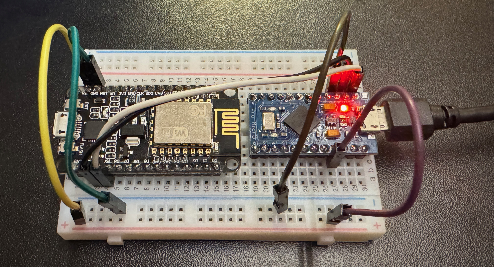

# WiFi USB HID Control

Remote control your computer's keyboard and mouse over WiFi using two microcontrollers - a powerful and flexible USB HID automation tool.


## Description

WiFi USB HID Control is a dual-microcontroller system that allows you to remotely control a computer's keyboard and mouse functions over WiFi. The system uses a Pro Micro (ATmega32U4) to act as a USB HID device and a NodeMCU (ESP8266) to provide WiFi connectivity with a web-based control interface.

Perfect for automation, remote testing, accessibility solutions, or educational purposes.

## Main Features

- **Remote Keyboard Control** - Type text, send keystrokes, and execute keyboard shortcuts
- **Remote Mouse Control** - Move mouse, click, double-click, and scroll
- **Live Mouse Trackpad** - Smooth mouse control with touch/drag support and adjustable sensitivity
- **Mouse Jiggler** - Automatic mouse movement to prevent screen lock
- **Web Interface** - Easy-to-use responsive web interface with trackpad
- **DuckyScript Support** - Execute Rubber Ducky scripts for automation
- **WiFi Manager** - Easy WiFi configuration with automatic reconnection
- **Multi-OS Support** - Quick scripts for Windows, MacOS, and Linux
- **REST API** - Programmatic control via HTTP endpoints
- **Network Scanner** - Built-in WiFi network scanner
- **Activity Logging** - Real-time activity log in web interface
- **Optional OLED Display** - 128x64 display shows status and actions in real-time

## Hardware Requirements

### Core Components
- **Pro Micro (ATmega32U4)** - 5V/16MHz version (acts as USB HID device)
- **NodeMCU (ESP8266)** - CP2102 version recommended (provides WiFi connectivity)
- **4× Jumper Wires** - Male-to-male (power, ground, TX, RX)
- **Breadboard** (optional) - For easy connection during testing
- **1× Micro-USB Cable** - For power and programming (Pro Micro only)
- **1× Micro-USB Cable** (optional) - Only needed for programming NodeMCU initially


*Example of NodeMCU and Pro Micro connected together*

### Optional Display
- **128x64 I2C OLED Display** (optional) - Shows device status and actions in real-time
  - Connects to NodeMCU pins: **D3 (SDA)**, **D4 (SCL)**
  - **Important:** Use D1/D2, NOT D0! GPIO16 (D0) doesn't support I2C
  - Displays WiFi status (IP address or AP credentials)
  - Shows current actions (script saved, jiggler on/off, etc.)
  - System works fully without display


## Software Requirements

- **Arduino IDE 1.8+** (or Arduino IDE 2.0+)
- **ESP8266 Board Support** - Install via Board Manager
- **Required Libraries:**
  - Keyboard (built-in with Arduino)
  - Mouse (built-in with Arduino)
  - ESP8266WiFi (included with ESP8266 board package)
  - ESP8266WebServer (included with ESP8266 board package)
  - EEPROM (built-in)
- **Optional Libraries (for OLED display):**
  - Adafruit GFX Library (install via Library Manager)
  - Adafruit SSD1306 (install via Library Manager)

### Installing ESP8266 Support

1. Open Arduino IDE
2. Go to **File → Preferences**
3. Add this URL to "Additional Board Manager URLs":
   ```
   http://arduino.esp8266.com/stable/package_esp8266com_index.json
   ```
4. Go to **Tools → Board → Board Manager**
5. Search for "esp8266"
6. Install "esp8266 by ESP8266 Community"

## Features in Detail

### USB HID Emulation
- Full keyboard emulation with special keys
- Mouse movement and clicking
- Support for modifier keys (Ctrl, Alt, GUI/Win)
- Function keys (F1-F12)
- Arrow keys and navigation

### Mouse Jiggler
- Automatic mouse movement every 2 seconds
- ±2 pixel horizontal movement
- LED indicator when active
- Remote enable/disable via web interface

### DuckyScript Parser
- Execute Rubber Ducky scripts
- Support for most common commands
- Comment support
- Delay commands for timing
- String typing with special characters

### Web Interface Features
- Responsive design works on phone, tablet, and desktop
- Live mouse trackpad with adjustable sensitivity (0.5x - 10x)
- Touch and mouse drag support for smooth control
- Real-time activity logging
- Quick action buttons
- Custom text typing
- Mouse control grid
- OS-specific quick scripts
- DuckyScript executor

#### Type Text


#### Mouse Control with Live Trackpad

*Live trackpad with adjustable sensitivity and directional controls*


#### Quick Scripts

*OS-specific quick scripts for common tasks*

#### Activity Log

*Real-time activity logging shows all commands and actions*

### WiFi Management

The device features intelligent WiFi management with automatic fallback:

**Automatic Connection:**
- On startup, attempts to connect to the last saved WiFi network
- If no saved network or connection fails, automatically switches to Access Point (AP) mode
- EEPROM storage ensures WiFi credentials persist across reboots

**Access Point Mode:**
- Creates WiFi network named **"USB-HID-Setup"** (password: **12345678**)
- All HID control features remain fully functional in AP mode
- Allows WiFi configuration through web interface at **192.168.4.1**
- Built-in network scanner helps find available networks

**Station Mode (Connected to WiFi):**
- Connects to your home/office network
- Accessible from any device on the same network
- IP address shown on device status display
- Can be reconfigured anytime through the web interface


*WiFi configuration interface with network scanner*

**Configuration Persistence:**
- WiFi credentials saved automatically when configured
- Device remembers settings even after power loss
- Easy reconfiguration through Settings page
- Automatic restart after applying new settings

## Quick Start

For experienced users who want to get started quickly:

1. **Wire the devices** - Connect 4 wires: VCC→Vin (power), GND→GND (ground), TX→RX and RX→TX (crossed, data)
2. **Upload Pro Micro code** - Select "Arduino Leonardo" board and upload `pro-micro/pro-micro.ino`
3. **Upload NodeMCU code** - Select "NodeMCU 1.0" board and upload `nodemcu/nodemcu.ino`
4. **Upload web files to NodeMCU** - Use "ESP8266 Sketch Data Upload" to upload the `nodemcu/data/` folder to LittleFS
5. **Connect via single USB** - Connect only Pro Micro to computer (powers both devices)
6. **Access the interface** - Connect to "USB-HID-Setup" WiFi (password: 12345678), visit http://192.168.4.1
7. **Use immediately** - All features work in AP mode! Optionally configure WiFi to connect to your network

**Note:** Device automatically tries saved WiFi on startup, falls back to AP mode if connection fails. All features work in both modes.

## Detailed Documentation

- **[WIRING.md](docs/WIRING.md)** - Complete hardware connection guide with diagrams
- **[SETUP.md](docs/SETUP.md)** - Step-by-step setup instructions
- **[API.md](docs/API.md)** - REST API documentation and command reference

## Use Cases

- **Remote Testing** - Test UI responses to keyboard/mouse input
- **Automation** - Automate repetitive tasks
- **Accessibility** - Alternative input method for accessibility needs
- **Education** - Learn about USB HID protocol and automation
- **Presentations** - Remote control during presentations
- **Security Research** - Educational tool for understanding HID attacks (authorized use only)

## Safety and Legal Notes

This tool is designed for:
- Personal use on your own devices
- Authorized testing and automation
- Educational purposes
- Accessibility solutions

**Do not use this tool for:**
- Unauthorized access to systems
- Malicious activities
- Any illegal purposes

Always ensure you have proper authorization before using this tool on any system.

## Project Structure

```
wifi-usb-hid/
├── pro-micro/
│   └── pro-micro.ino          # Arduino sketch for Pro Micro
├── nodemcu/
│   └── nodemcu.ino            # Arduino sketch for NodeMCU
├── docs/
│   ├── README.md              # This file
│   ├── WIRING.md              # Hardware connection guide
│   ├── SETUP.md               # Setup instructions
│   └── API.md                 # API documentation
└── .gitignore                 # Git ignore file
```

## Troubleshooting

### Pro Micro not recognized
- Install drivers for ATmega32U4
- Try different USB cable or port
- Check if board is selected as "Arduino Leonardo"

### NodeMCU won't connect to WiFi
- Check SSID and password
- Ensure 2.4GHz WiFi (ESP8266 doesn't support 5GHz)
- Try connecting to AP mode and reconfigure

### Commands not working
- Verify TX/RX connections are correct (crossed)
- Check GND is connected
- Use Serial Monitor to debug
- Test with PING command

### More troubleshooting help
See [SETUP.md](SETUP.md) for detailed troubleshooting steps.

## Contributing

This is an open project. Feel free to:
- Report issues
- Suggest improvements
- Share your use cases
- Contribute code enhancements

## License

This project is provided as-is for educational and personal use. Use responsibly and ethically.

## Credits

Created for automation enthusiasts, accessibility advocates, and makers worldwide.

Built with Arduino, ESP8266, and the power of open-source hardware.

---

**Ready to get started?** Head to [SETUP.md](SETUP.md) for step-by-step instructions!
