# Features

### Type Text
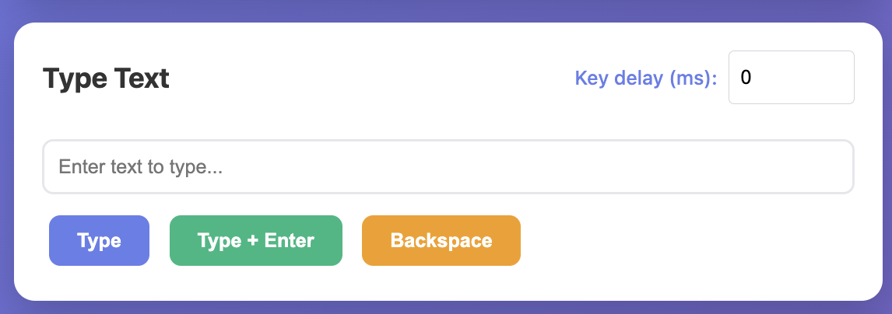

Type text remotely and send keyboard shortcuts to the target computer.

### Mouse Control with Live Trackpad
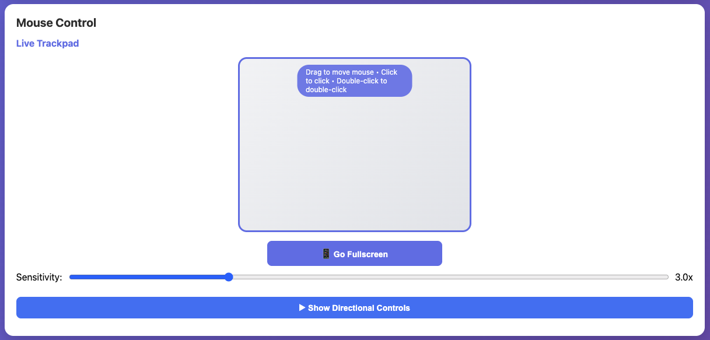

Control mouse movement with directional buttons or use the live trackpad with adjustable sensitivity (0.5x - 10x) for smooth, intuitive control on desktop and mobile devices. Supports single-click, double-click gestures for highlighting text, and right-click for context menus.

### Keyboard Capture
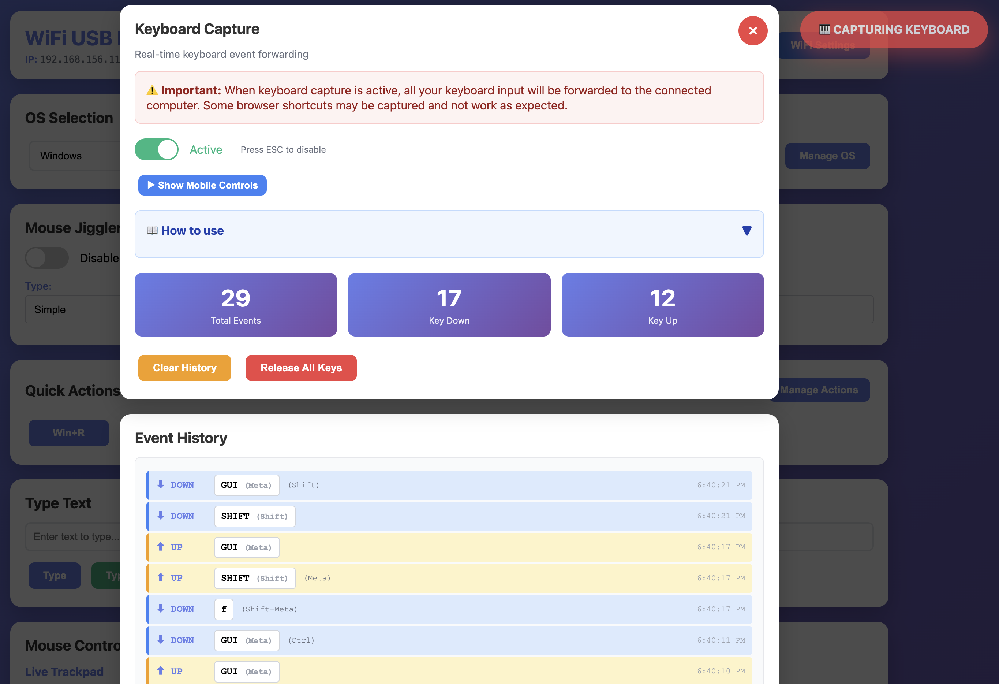

Real-time keyboard event forwarding that captures all keyboard input in the browser and sends it directly to the connected computer. Perfect for remote typing, keyboard shortcuts, and situations where you need full keyboard control.

**Features:**
- Real-time key press and release events forwarded to target computer
- Support for all standard keys including modifiers (Ctrl, Alt, Shift, GUI/Win/Cmd)
- Function keys (F1-F12), arrow keys, and special keys (Tab, Backspace, Delete, etc.)
- Event history display showing all captured keystrokes with timestamps
- Statistics tracking for total events, key down, and key up counts
- ESC key to quickly disable capture mode

**Mobile Controls:**
- Toggle-able mobile control panel with on-screen buttons
- Modifier key toggles (Ctrl, Alt, Shift, GUI) that stay pressed until toggled off
- Navigation keys with hold-to-repeat: Tab, Backspace, Delete, and arrow keys
- Quick access to fullscreen mouse control
- Keyboard input field for typing on mobile devices

The mobile interface is designed for efficient remote control, providing essential keys and modifiers on-screen. This allows for complex keyboard combinations and text entry directly from a mobile device.

| Mobile Keyboard Controls | Mobile Input Field |
|---|---|
| 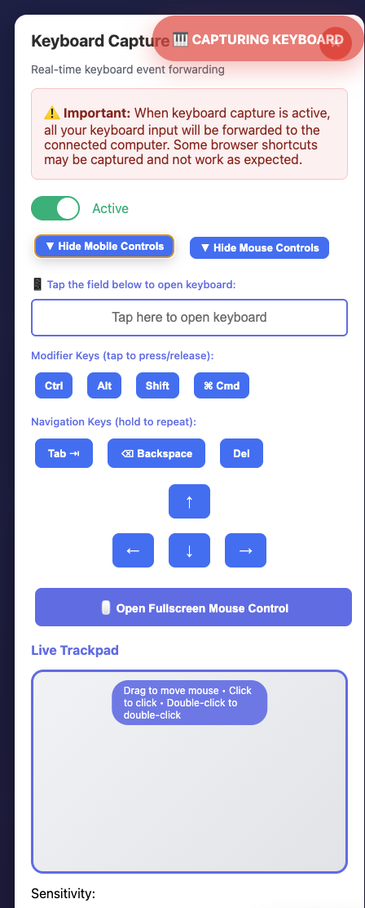 | 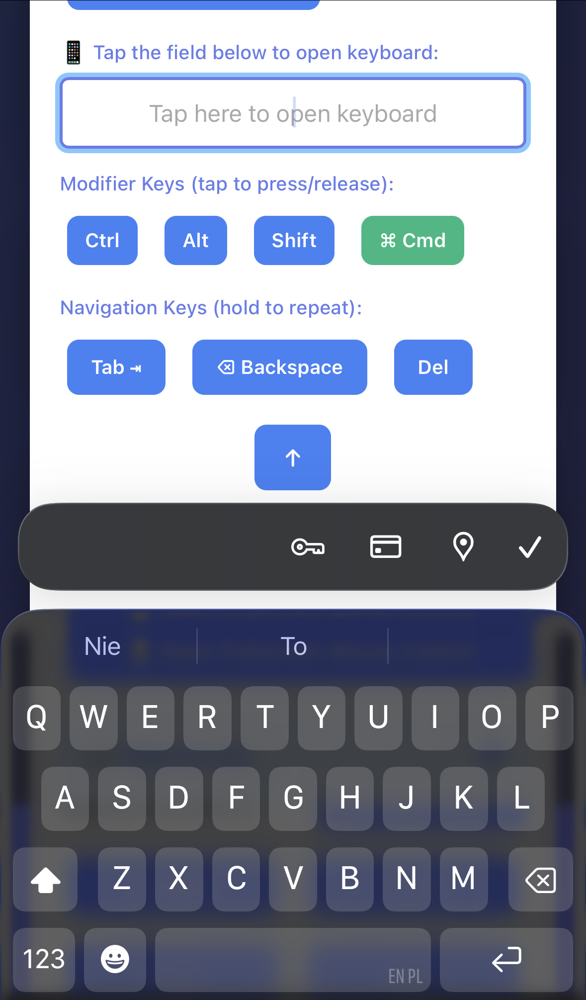 |

**Use Cases:**
- Remote keyboard control when physical access is limited
- Testing keyboard shortcuts on target systems
- Accessibility assistance for users who need alternative input methods
- Automation and scripting with precise key timing

### Quick Actions
Customizable one-click keyboard shortcuts for each operating system. Create, edit, and manage quick action buttons through the dedicated management interface at `/manage-actions.html`.

**Features:**
- Per-OS quick actions (Windows, macOS, Linux, and custom OS)
- DuckyScript command support (e.g., `GUI_R`, `CTRL_C`, `ALT_TAB`)
- Custom button labels and descriptions
- Five color schemes (Primary, Success, Warning, Info, Danger)
- Drag-and-drop reordering with up/down buttons
- Persistent storage across reboots

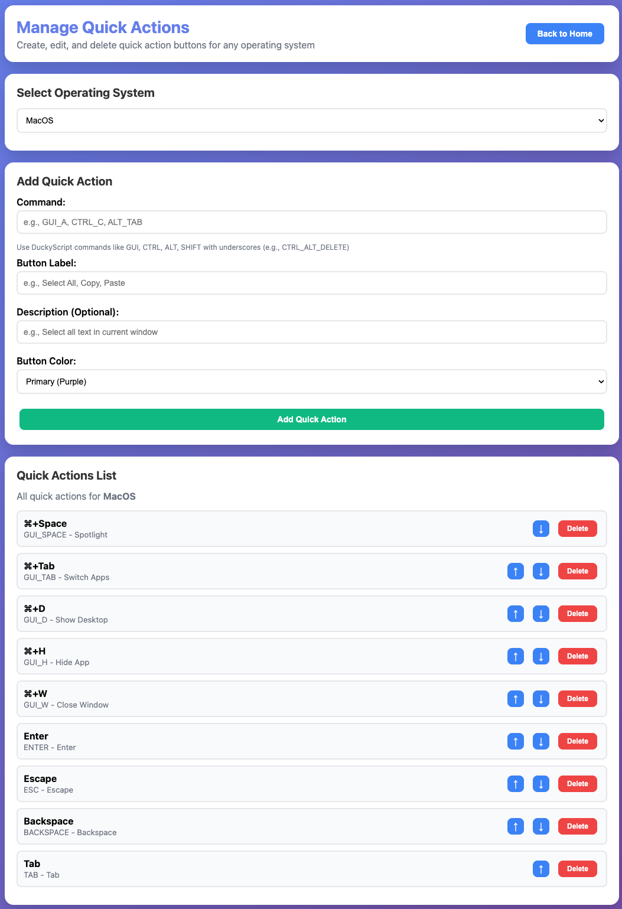

### Quick Scripts
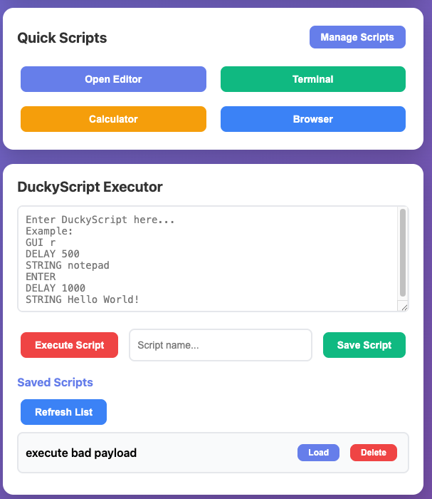

Create and manage custom DuckyScript automation buttons for each operating system. Access the full script editor at `/manage-scripts.html` to build complex automation workflows.

**Features:**
- OS-specific quick scripts for Windows, macOS, Linux, and custom OS
- Full DuckyScript editor with multi-line support
- Script ID system for updating existing scripts
- Custom button labels and color schemes
- Built-in example scripts for common tasks
- Persistent storage in LittleFS

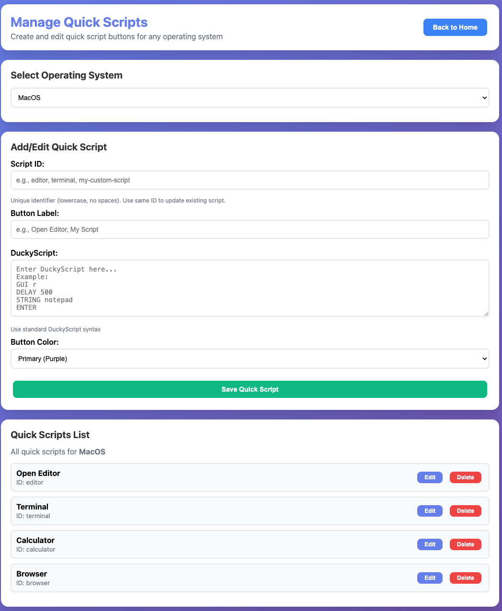

### Activity Log
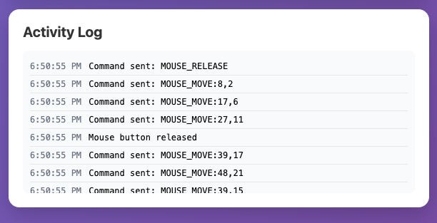

Real-time activity logging shows all commands and actions with timestamps.

### Custom Operating Systems

Extend beyond Windows, macOS, and Linux by creating custom OS categories with their own quick actions and scripts. Perfect for specialized systems like Android, ChromeOS, Raspberry Pi, or any custom environment.

**Features:**
- Add unlimited custom OS categories
- Each custom OS has dedicated quick actions and scripts
- OS selection persists across page navigation
- Quick access to manage actions for any OS
- Delete custom OS when no longer needed

### WiFi Management
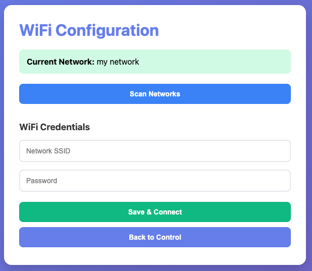

Built-in WiFi manager with network scanner. Device starts in AP mode (SSID: "USB-HID-Setup") and can be configured to connect to 
your home/office network. The device can store multiple saved networks and always tries to connect on startup with automatic fallback to AP mode if connection fails.

### File Management
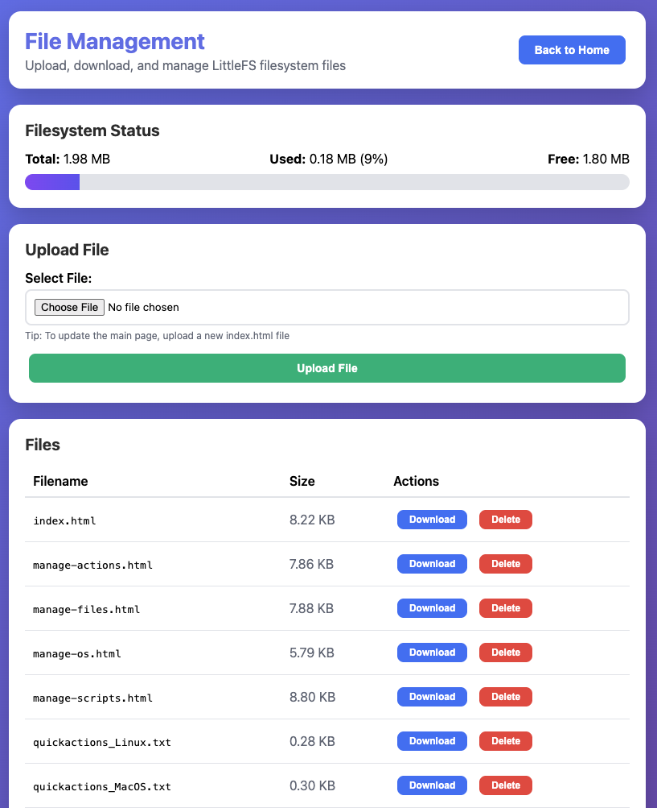

Remote file system management for LittleFS files. Upload, download, and manage files directly through the web interface at `/manage-files.html` without requiring physical access to the device.

**Features:**
- Upload any file type to LittleFS filesystem (HTML, CSS, JS, TXT, etc.)
- Replace existing files including core interface files (index.html, style.css, script.js)
- Download files for backup or verification
- Delete files with confirmation prompts
- View filesystem status (total, used, free space with visual progress bar)
- File list with sizes displayed in KB
- Core files marked with special badge (index.html, style.css, script.js)
- HTTP Basic Authentication protects all file operations
- Automatic filename sanitization to prevent security issues
- Space availability check before uploads (maintains 10% safety margin)
- Chunked upload handling to optimize memory usage on ESP8266

**Use Cases:**
- Update the main interface remotely without reflashing
- Upload custom HTML/CSS/JS files for interface customization
- Add new resource files (images, fonts, etc.)
- Backup important files by downloading them
- Monitor filesystem usage to prevent storage issues

**Security:**
- All file operations require authentication
- Filename sanitization prevents path traversal attacks
- Upload size validation prevents filesystem overflow
- Safe deletion with confirmation prompts for user protection

Access the file manager through the "File Manager" button in the main interface header or navigate directly to `http://<device-ip>/manage-files.html`.

### Additional Features

- **Web Authentication** - HTTP Basic Authentication protects all endpoints (default: admin/WiFi_HID!826)
- **HTTPS Support** - Secure communication with self-signed certificate (HTTP + HTTPS on ports 80 and 443)
- **Script Storage** - Save and load DuckyScripts to/from LittleFS for reuse
- **Advanced Mouse Jiggler** - Configurable automatic mouse movement with three patterns (Simple, Circles, Random), adjustable diameter (1-50px), and delay settings (100-60000ms) to prevent screen lock
- **REST API** - Programmatic control via HTTP/HTTPS endpoints
- **Optional OLED Display** - 128x64 display shows status, IP address, and web credentials
